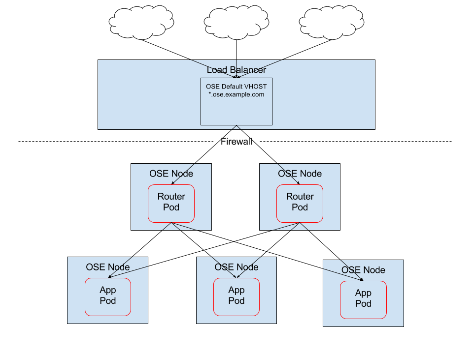

---
---
= External Load Balancer Integrations with OpenShift Enterprise 3
Eric Sauer <esauer@redhat.com>, obedin@redhat.com
v1.0, 2015-10-30
:scripts_repo: https://github.com/rhtconsulting/rhc-ose
:toc: macro
:toc-title:

toc::[]

== Load Balancing For HA Applications

=== Simple Integration (External LB as a Passthrough)

This is the most lightweight integration possible between OpenShift and an External Load Balancer. The goal here is to satisfy common requirements that application traffic originating outside of an organization go through a DMZ or public network layer before hitting applications behind a firewall.

In order to keep the implementation as simple as possible, we use the load balancer as a simple passthrough to OpenShift’s routing layer. The OpenShift routers then handle things like SSL termination and making decisions on where to send traffic for particular applications.

Required Components for a Simple Integration include:

* External Load Balancer
** Single VIP for OpenShift Apps
** SSL Passthough
** Round Robin Load Balancing
* OpenShift Router
** Will support application Specific Routes
** Handles SSL via a combination of Wildcard an Unique certs
*** Any application can create a route with a unique certs
*** Applications that want SSL, but don’t provide unique certs will use the wildcard cert provided for the router
*** Non-Secure HTTP routes are also supported and are the default behavior out of the box

=== Hybrid Integration (External LB Termination)

NOTE: A Hybrid integration is recommended only in the case that security policy or network structure inhibit the ability to implement the Simple Integration above.

This scenario is very similar to the Simple Integration with one simple, but important difference. In this scenario we are offloading SSL termination to the Load Balancer, instead of to OpenShift. The advantage here is that we have the ability to host SSL Certificates and unique public IP addresses at the Load Balancer level, which some organizations prefer. The drawback is that, in order to do that, we now have some extra administration overhead on the Load Balancer in order to onboard each new application. This process can generally be automated without much trouble, but it does significantly increase the Level of Effort required to integrate.

NOTE: For organizations that use an F5 BIG-IP as their External Load Balancer, OpenShift provides a built-in plugin for integrating that as OpenShift’s router, thus removing the overhead of building this custom automation.

Required Components for the Hybrid approach include:

* External Load Balancer
** One Default VIP, hosting a Wildcard certificate for OpenShift applications
** One additional VIP per Application that requires one of:
*** Unique Certificate
*** Vanity URL that doesn’t match the OpenShift Wildcard domain name
Round Robin config Responsible for
LB algorithm (sticky, round robin, etc.)
OpenShift Router Responsible for
Example (with Diagram)

=== Full Integration (Integrating F5 as the OpenShift Router)

OpenShift provides an out of the box plugin that allows an administrator to configure OpenShift to use an external F5 BIG-IP appliance as it’s Router. This feature works by providing OpenShift with access to the BIG-IP’s API in order to dynamically configure new unique Virtual Hosts as new applications come online. While this feature makes for a much more dynamic environment with Enterprise-ready features, it has some much more stringent requirements in order to be successful.

Requirements for a Full Integration include:

* F5 BIG-IP version 11.6 or greater
* Connectivity and Authentication Access to the BIG-IP REST API from OpenShift nodes
** Specifically the OpenShift nodes running your router pods.
** SSH Access to the BIG-IP for transfering files like Certs and Keys
* Authorization allowances for OpenShift to Control the BIG-IP to do things like:
** Create VirtualHosts
** Delete VirtualHosts
** Add and Configure Certificates
* One or more link:https://docs.openshift.com/enterprise/3.0/admin_guide/routing_from_edge_lb.html#establishing-a-tunnel-using-a-ramp-node[OpenShift Ramp Nodes] by which access to the internal SDN is provided to the BIG-IP

In this way, the OpenShift router pods work as configuration agents for the F5, and rather than actually handling incomming web traffic, just watch the OpenShift API for new routes to be created, and passes that configuration information up to the F5 via the API to configure routes and handle traffic at the Load Balancer level.

Through the use of tunnels provided by Ramp Nodes, the F5 BIG-IP is given direct access to OpenShift pods, removing the need for an intermediate network hop through a proxy server.

For more information on configuration, view the routing section of the official OpenShift Enterprise docs:
https://docs.openshift.com/enterprise/3.0/install_config/install/deploy_router.html#deploying-the-f5-router

== Load Balancing For HA Infrastructure

=== External Loadbalancing for the OpenShift Master

Starting with version 3.0.1 of OSEv3, it's possible to do HA masters, in an active/standby fashion – i.e.:one master is active and the others are standby and available to become active when/if needed. Pacemaker is used to manage the master nodes and ensure one (and only one) is always active – through the use of fencing agents.

In addition, for HA, it is recommended to host etcd on separate nodes. Since clustered etcd operates in an active/active mode, 3 or more instances are needed for the cluster to operate correctly.

The OpenShift Enterprise documentation describes how to configure HA, with Pacemaker and etcd on separate hosts. However, this configuration also includes the management of the VIP. In the case of the Amgen environments, where the master nodes aren't on the same subnet (one On-Premise and one AWS), using the OpenShift ansible installer to perform the HA will not quite fit the environment. In this case, the installer takes care of the OpenShift setup for multiple masters (and multiple etcd instances), but the actual HA configuration is done afterwards. To accomplish this, the following configuration needs to be added to the /etc/ansible/hosts file – in addition to listing all masters, etcd, and node instances in their respective sections:

----
# master cluster ha variables when using a different HA solution
# For installation the value of openshift_master_cluster_hostname must resolve
# to the first master defined in the inventory.
# The HA solution must be manually configured after installation and must ensure
# that the master is running on a single master host.
openshift_master_cluster_hostname=<master-vip-fqdn>`
openshift_master_cluster_public_hostname=<master-vip-fqdn>
openshift_master_cluster_defer_ha=True
----

After the installation has successfully completed, follow the Red Hat Enterprise Linux HA add-on documentation to configure the service for the openshift-master in an HA mode, and to enable fencing.
Note: With the use of an external VIP, it's advised to ensure that each master can resolve the alias FQDN to its own IP. This to ensure that the “openshift-master” process properly starts only the new “active” node in the event of a fail-over. The external VIP may not be quite ready by the time the newly become active node is attempting to access the VIP FQDN, and hence starting the openshit-master may fail. To work around this, make sure the VIP FQDN is added to each master's /etc/hosts, pointing to its own IP.

Example of Pacemaker configuration
Below is an example of setting up the cluster with Pacemaker, and adding “openshift-master” systemd:
On all members of the cluster, execute the following commands:
----
yum install -y pcs
systemctl enable pcsd
systemctl start pcsd
echo "passwd123" | passwd --stdin hacluster
----

On the first member of the cluster, execute the following commands:
----
pcs cluster auth <host1> <host2> -u hacluster -p passwd123 --force
pcs cluster setup --name openshift_master <host1> <host2> --force
pcs cluster enable --all
pcs cluster start --all
pcs resource create master systemd:openshift-master op start \
timeout=90s stop timeout=90s --group openshift-master
----

Use `pcs status` to check that the cluster was successfully created. Also, for testing, maintenance, etc. the “pcs cluster standby” command can be used to force a cluster member to become standby and make the next member active.
----
pcs status
pcs cluster standby <host1>
pcs status

# -- check that another host is now active
pcs cluster unstandby <host1>
----
